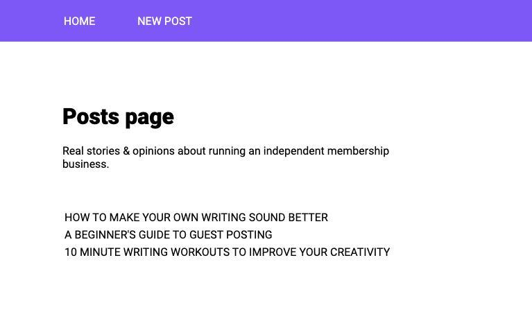

## Getting Started

First, run the development server:

```bash
npm run dev
# or
yarn dev
```

Open [http://localhost:3000](http://localhost:3000) with your browser to see the result.

You can start editing the page by modifying `pages/index.js`. The page auto-updates as you edit the file.

# Project Name
This is a simple Blog MVP | AT.

## Table of contents
* [General info](#general-info)
* [Screenshots](#screenshots)
* [Technologies](#technologies)
* [Setup](#setup)
* [Features](#features)
* [Status](#status)
* [Inspiration](#inspiration)
* [Contact](#contact)

## General info
Blog MVP has Posts and Comments features. It was developed for technical assessment for DevelopsToday

## Screenshots


## Technologies
* axios - version 0.20.0
* babel-plugin-macros - version 2.8.0
* next - version 9.5.3
* react - version 16.13.1
* react-dom - version 16.13.1
* react-is - version 16.13.1
* styled-components - version 5.2.0

## Setup
Describe how to install / setup your local environement / add link to demo version.

## Features
List of features ready and TODOs for future development
* The blog has Latest Posts page (/ route)
* The blog has Post page (`/posts/:postId` route)
* You are able to create a new post on Create Post page (`/posts/new` route)

To-do list:
* Add Redux as data layer with any middlewares
* Deploy the app to any free hosting

## Status
Project is: _in progress_ becuse I need to add Redux store, but the time is up for technical assessment.

## Inspiration
Project inspired by DevelopsToday.

## Contact
Created by [@MonsiSome](https://github.com/MonsiSome/) - feel free to contact me!